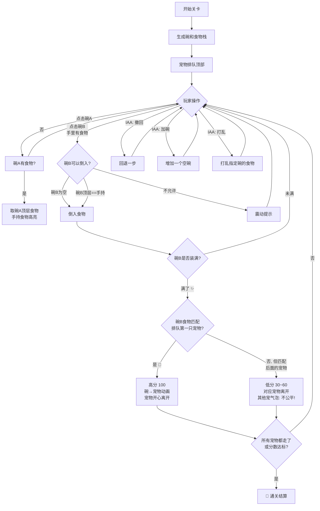

# 🐾 铲屎官疯了 — 游戏设计文档 v2

> 类「脑洞倒水」的食物分配解谜游戏  
> 引擎：团结引擎 | 平台：抖音小游戏 | 变现：IAA

---

## 一、核心概念

几只宠物在顶部排队等饭吃。下方散落着若干碗，每个碗里叠着 0~4 个食物（随机打乱），同一种食物才能叠在一起。

玩家点击碗取出**最顶层**的食物，导入另一个碗——目标碗必须是**空碗**，或者**顶层是同款食物**。当某个碗装满了（2~3层），它就被点亮完成。如果这个碗对应的食物恰好匹配排队第一只宠物 → 高分，碗飞过去，宠物开心离开；如果匹配后面的宠物 → 低分，其他宠物冒气泡「不公平 ！」

```
┌──────────────────────────────────────────┐
│  🐱排队1  🐶排队2  🐹排队3               │  ← 宠物排队（顶部）
│  (摇晃)   (摇晃)   (摇晃)                │
├──────────────────────────────────────────┤
│                                          │
│   🥣         🥣         🥣               │
│  ┌──┐      ┌──┐      ┌──┐              │
│  │🐟│      │  │      │🌻│              │
│  │🐟│      │  │      │🦴│              │  ← 散落碗（各碗叠着0~4个食物）
│  └──┘      └──┘      │🦴│              │
│   2层      空碗       └──┘              │
│                       2层(但不匹配)      │
│                                          │
│   🥣         🥣                          │
│  ┌──┐      ┌──┐                         │
│  │🌻│      │🦴│                         │
│  │🌻│      │🦴│                         │
│  │🌻│      │🦴│  ← 满了！3层都是🦴       │
│  └──┘      └──┘      ✨ 点亮！           │
│  完成！     → 飞去喂狗 → 狗开心离开      │
│                                          │
├──────────────────────────────────────────┤
│  [↩撤回] [空的碗] [🔀打乱] 得分: 160    │  ← IAA 辅助按钮
└──────────────────────────────────────────┘
```

---

## 二、流程图



---

## 三、数据结构

```csharp
/// 碗：食物从栈底到栈顶（index 0=底, Count-1=顶）
public class Bowl
{
    public int bowlId;                    // 碗编号
    public int capacity = 3;              // 装满阈值（简单关用3，难关用2）
    public List<FoodType> foods;          // 食物栈（底→顶）
    public bool isCompleted;              // 是否已完成（装满且匹配宠物）
    public Vector2Int gridPos;            // 网格位置

    public FoodType? Top() => foods.Count > 0 ? foods[^1] : null;
    public bool IsEmpty => foods.Count == 0;
    public bool IsFull => foods.Count >= capacity;

    public void Push(FoodType f) { if (!IsFull) foods.Add(f); }
    public FoodType Pop()
    {
        var f = foods[^1];
        foods.RemoveAt(foods.Count - 1);
        return f;
    }
}
```

```csharp
/// 关卡配置
public class LevelConfig : ScriptableObject
{
    public int levelId;
    public string levelName;
    public int capacity = 3;              // 碗容量 2~3
    public int bowlCount = 6;             // 碗数量
    public PetType[] petQueue;            // 宠物排队顺序
    public BowlInit[] bowlInits;          // 碗初始食物配置
    public int targetScore;               // 通关分数
    public int maxMoves;                  // 最大步数（0=无限）
}

[System.Serializable]
public struct BowlInit
{
    public FoodType[] foodStack;           // 从底到顶
}
```

```csharp
/// 计分规则
public class ScoreConfig
{
    public static int MatchFirst   = 100;   // 匹配队首宠物
    public static int MatchSecond  = 60;    // 匹配第2只
    public static int MatchThird   = 30;    // 匹配第3只及以后
    public static int ComboBonus   = 20;    // 连续完成碗（无浪费步骤）
}
```

---

## 四、核心算法

### 4.1 倒食物判定

```
CanPour(source, target):
  if source.IsEmpty:          return false  // 源碗没食物
  if target.IsFull:           return false  // 目标碗满了
  topFood = source.Top()

  if target.IsEmpty:          return true   // 空碗可倒入任意食物
  if target.Top() == topFood: return true   // 顶层同款
  return false                               // 不同类食物不能叠
```

### 4.2 完成检测

```
OnPourComplete(source, target):
  Pour food from source to target          // 执行倒入
  if target.IsFull:
    target.isCompleted = true
    matchedPet = FindMatchingPet(target.Top()) // 找到对应食物的宠物
    if matchedPet == queue[0]:
      score += ScoreConfig.MatchFirst
    else if matchedPet == queue[1]:
      score += ScoreConfig.MatchSecond
    else:
      score += ScoreConfig.MatchThird
    RemovePetFromQueue(matchedPet)           // 宠物离开
    AnimateBowlToPet(target, matchedPet)     // 碗飞向宠物
    if matchedPet != queue[0]:
      ShowBubble(otherPets, "不公平！")      // 其他宠物抱怨
```

### 4.3 关卡生成算法（确保可解）

```
GenerateLevel(pets, difficulty):
  bowls = Create N empty bowls
  targetScore = 0

  // 逆推法：从终点倒推生成初始状态
  plannedMove = []
  for each pet in reversed(pets):
    // 为该宠物创建一个满碗
    bowl = PickRandomEmptyBowl(bowls)
    foodType = GetPetPreferredFood(pet)
    for i in 1..capacity:
      bowl.Push(foodType)                 // 直接倒满（跳过倒水步骤）
    // 现在这个碗是满的，需要把它「拆散」到其他碗
    ShuffleDissolve(bowl, bowls)          // 把食物分散出去

  // 正向验证
  if !IsSolvable(bowls, petQueue):
    return GenerateLevel(pets, difficulty) // 递归重试

  targetScore = CalculateMinScore(pets) * 0.8  // 通关分数=最低分*80%

ShuffleDissolve(fullBowl, allBowls):
  // 把满碗的食物逐步「倒」到其他碗，模拟逆过程
  while fullBowl.Count > 1:
    target = RandomEmptyOrCompatible(fullBowl.Top(), allBowls)
    fullBowl.Pop() → target.Push()
```

### 4.4 可解性验证

```
IsSolvable(bowls, pets):
  // BFS搜索：每个状态是 (bowls, heldFood, fedPets)
  queue = [(initialBowls, null, [])]
  visited = Set()

  while queue not empty:
    state = queue.Dequeue()
    if AllPetsFed(state): return true

    for each source in bowls:
      if source.IsEmpty: continue
      for each target in bowls:
        if source == target: continue
        if CanPour(source, target):
          nextState = ExecutePour(source, target)
          if nextState not in visited:
            visited.Add(nextState)
            queue.Enqueue(nextState)

  return false
```

---

## 五、IAA 变现点

| 功能 | 触发方式 | 广告类型 | 描述 |
|------|---------|---------|------|
| ↩ **撤回一步** | 每局免费1次，之后看广告 | 激励视频 | 回退最近一次倒食物操作 |
| 🥣 **增加空碗** | 看广告获得 | 激励视频 | 在场景中新增一个空碗，增加灵活度 |
| 🔀 **打乱某碗** | 看广告 | 激励视频 | 随机打乱指定碗中食物层顺序 |
| 💡 **提示下一步** | 每局免费1次，之后看广告 | 激励视频 | 高亮显示最佳下一步操作 |
| ⏪ **全部撤回** | 看广告 | 激励视频 | 回退到关卡初始状态 |

---

## 六、难度递进

| 关卡段 | 碗数 | 容量 | 宠物数 | 食物种类 | 特点 |
|--------|------|------|--------|----------|------|
| 1-3 新手 | 4-5 | 3 | 2 | 2 | 仅猫和狗，食物层数少 |
| 4-8 进阶 | 5-6 | 3 | 2-3 | 3 | 加入仓鼠，食物需匹配 |
| 9-15 挑战 | 6-7 | 2 | 3-4 | 4 | 容量降为2，更苛刻 |
| 16-25 困难 | 7-8 | 2 | 4-5 | 5 | 多种食物，多碗分布 |
| 26+ 大师 | 8-10 | 2 | 5-6 | 6+ | 全宠物，需精密规划 |

---

## 七、UI 布局（750×1334 竖屏）

```
┌──────────────────────────────── 750 ────────────────┐
│  ▓▓▓▓ 第1关    步数:12    得分:0/200  ⏱ 02:00 ▓▓▓▓ │ y=600  HUD
│  [💡提示] [↩撤回] [🥣+碗] [🔀打乱]                 │ y=540  按钮
├──────────────────────────────────────────────────────┤
│                                                      │
│   🐱排队1     🐶排队2     🐹排队3                    │ y=300  宠物栏
│   (左右摇晃)  (左右摇晃)  (哭脸)                     │
│                                                      │
│         🥣碗(2,0)          🥣碗(3,1)               │ y=200
│        ┌──────┐           ┌──────┐                 │
│        │ 🐟顶 │           │ 🌻顶 │                 │
│        │ 🐟底 │           │      │                 │
│        └──────┘           └──────┘                 │
│                                                      │
│   🥣(1,1)        🥣(1,2)        🥣(3,2)            │ y=0
│  ┌──────┐       ┌──────┐       ┌──────┐           │
│  │ 🦴   │       │ 空   │       │ 🌻🌻 │ ✨满       │
│  └──────┘       └──────┘       │ 🌻   │           │
│                                 └──────┘           │
│   🥣(2,2)                       🥣(0,1)            │ y=-200
│  ┌──────┐                      ┌──────┐           │
│  │ 🐟🐟 │ ←2层                 │ 🦴🦴 │ ←2层       │
│  └──────┘                      └──────┘           │
│                                                      │
│  👆 手持：🐟（当前拿着）                              │ y=-400
├──────────────────────────────────────────────────────┤
│                    [🎉 通关面板]                      │ 居中覆盖
└──────────────────────────────────────────────────────┘
```

---

## 八、动画清单

| 动画 | 描述 | 时长 |
|------|------|------|
| 宠物摇晃 | 排队宠物左右缓慢摇摆，等待时 | 持续循环 |
| 取食物 | 碗顶食物弹出+缩小飞到屏幕中央 | 0.3s |
| 倒食物 | 食物从手移到目标碗+落下 | 0.25s |
| 碗点亮 | 碗满时白色闪光+金色边框 | 0.4s |
| 碗飞宠物 | 碗缩小飞向宠物头顶→宠物开心表情 | 0.5s |
| 宠物离开 | 宠物+碗组合左移出屏幕+淡出 | 0.6s |
| 气泡文字 | "不公平！"气泡弹出+2秒消失 | 2s |
| 哭脸 | 未被喂的宠物切换哭脸表情 | 即时 |

---

## 九、里程碑

| 阶段 | 内容 | 时间 |
|------|------|------|
| M1 核心玩法 | 碗生成、倒食物判定、满碗匹配、宠物离开 | 本周 |
| M2 关卡系统 | 关卡数据、生成算法、可解验证、通关判定 | 下周 |
| M3 UI+动画 | 完整布局、所有动画、气泡提示 | 第3周 |
| M4 IAA接入 | 撤回/加碗/打乱/提示 → 激励视频 | 第4周 |
| M5 打磨发布 | Bug修复、难度调优、抖音SDK接入 | 第5周 |

---

*文档版本 v2 | 2026-07-11*
